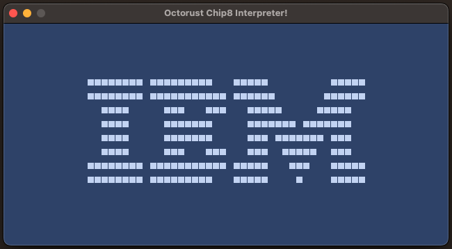

# Octorust 👾🦀

## Description 🧬

`Octorust` is a CHIP-8 interpreter/emulator in the making, written in Rust. This project aims to offer a reliable and efficient implementation of the CHIP-8 system for educational and development purposes.

## Features 💫

- CHIP-8 instruction interpretation

## Development Status 🖌️

This project is in its early stages but aims to provide a solid foundation for CHIP-8 emulation.

### Basic instructions

Instructions needed to run a basic ROM which displays IBM Logo on screen. This ROM needs few instructions, and one of them is the ``DISPLAY`` instruction, so many people start with these.

  | Status   | Code   | Instruction |
  |:--------:|:------:|-------------|
  | ✅       | `00E0` | clear screen |
  | ✅       | `1NNN` | jump |
  | ✅       | `6XNN` | set register VX |
  | ✅       | `7XNN` | add value to register VX |
  | ✅       | `ANNN` | set index register I
  | ✅       | `DXYN` | display/draw
  
### Other instructions

  | Status    | Code   | Instruction |
  |:---------:|:------:|-------------|
  |✅         | `2NNN` | subroutine call |
  |✅         | `00EE` | subroutine return |
  |✅         |`3XNN`| Skip
  |✅         |`4XNN`| Skip
  |✅         |`5XY0`| Skip
  |✅         |`9XY0`| Skip
  |✅         |`8XY1`| Binary OR
  |✅         |`8XY2`| Binary AND
  |✅         |`8XY3`| Logical XOR
  |✅         |`8XY4`| Add VX
  |✅         |`8XY5`| Substract VX=VX-VY
  |✅         |`8XY7`| Substract VX=VY-VX
  |✅         |`8XY6`| Shift
  |✅         |`8XYE`| Shift
  |🔜         |`BNNN`| Jump with offset
  |🔜         |`CXNN`| Random
  |⌛         |`EX9E`| Skip if
  |⌛         |`EXA1`| Skip if
  |🔜         |`FX07`, `FX15` and `FX18`| Timers
  |✅         |`FX1E`| Add index register I
  |🔜         |`FX0A`| Get key (on key up, beeps while pressed down)
  |🔜         |`FX29`| Font char
  |🔜         |`FX33`| Binary-coded decimal conversion
  |🔜         |`FX55`| Store
  |🔜         |`FX65`| Load

### Input handling

  🔜

## Thank you! 💕

Last but not least, I'd like to give a big thank you to everyone who helped along the way. 😊

- [Timendus's CHIP-8 test suite](https://github.com/Timendus/chip8-test-suite) ❤️
- [Cowgod's Chip-8 Technical Reference v1.0](http://devernay.free.fr/hacks/chip8/C8TECH10.HTM). ❤️
- [Tobias V. Langhoff's Guide to making a CHIP-8 emulator](https://tobiasvl.github.io/blog/write-a-chip-8-emulator/). ❤️
- A special thank you to [nifIheimr](https://github.com/nifIheimr) for providing the seed idea that ultimately blossomed into this project. ❤️
